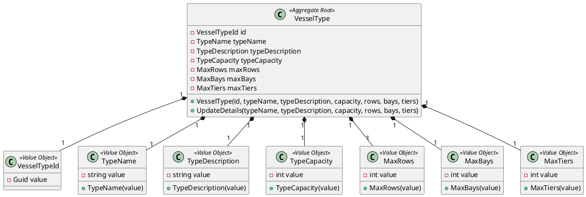
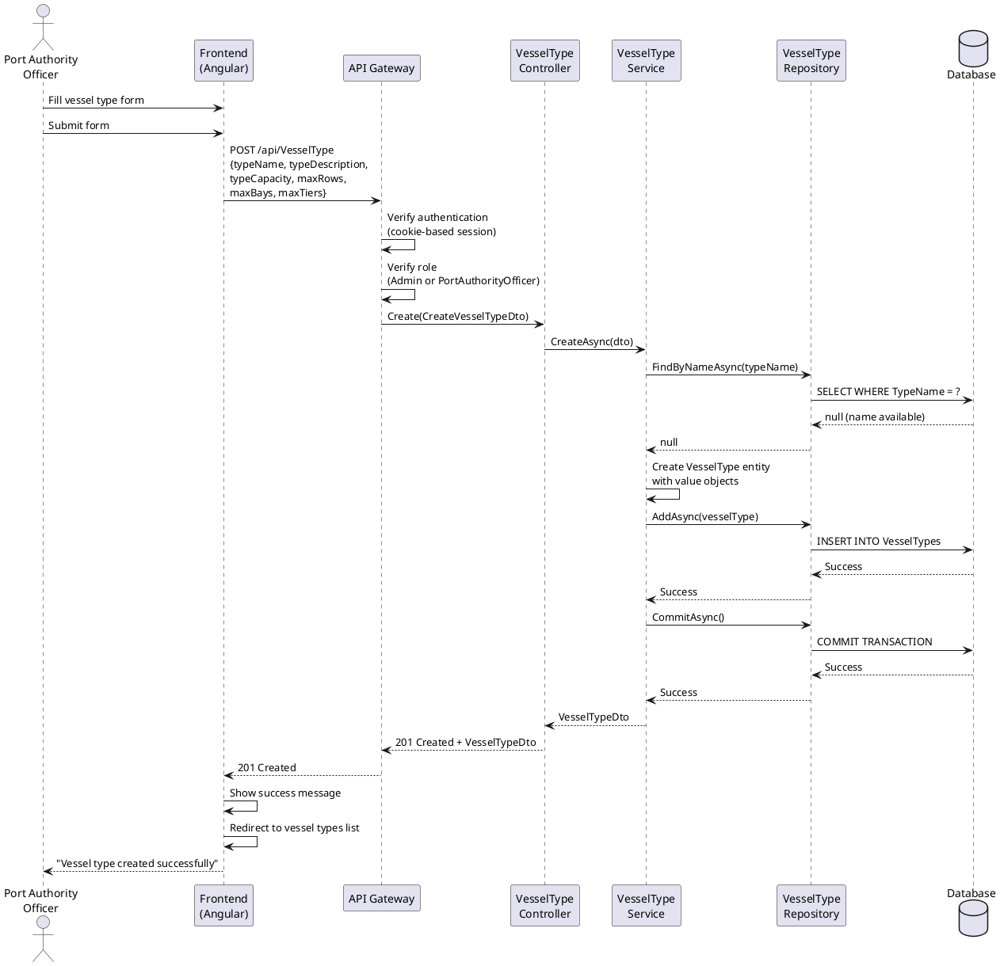
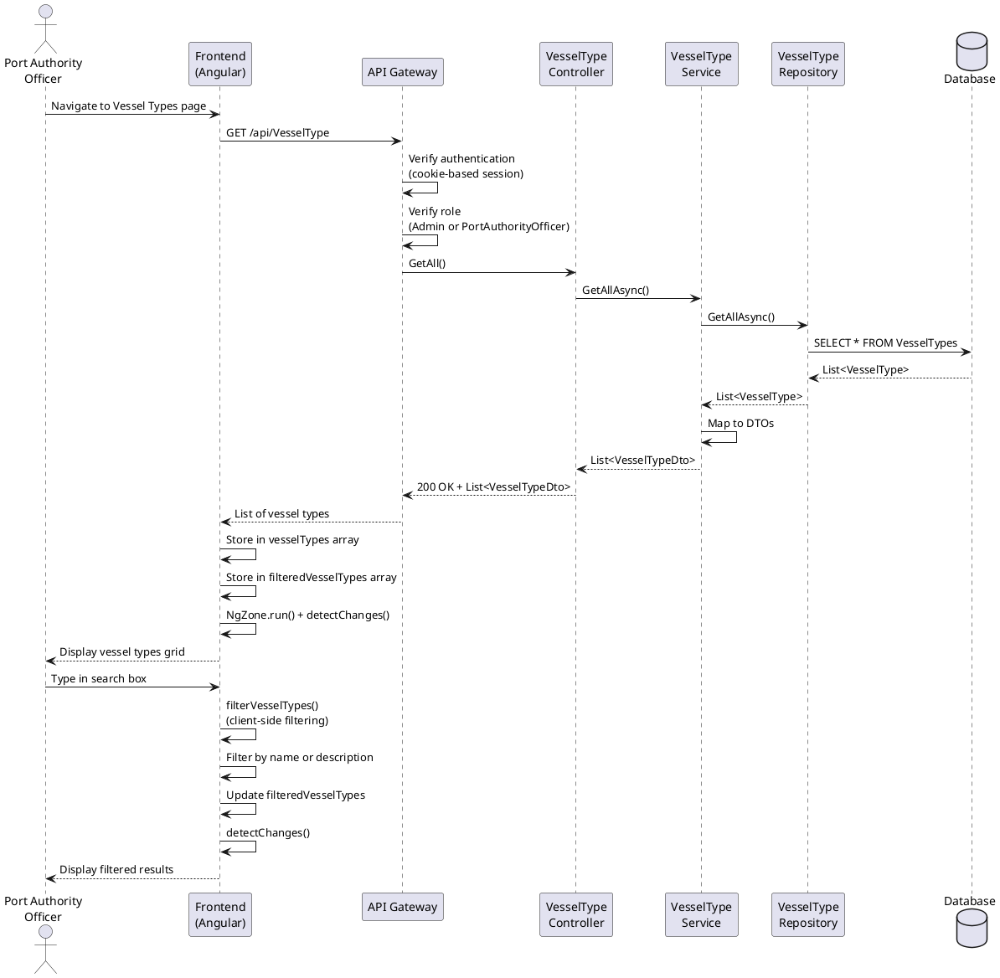

# US 2.2.1 - As Port Authority Officer, I want to create, list, and search vessel types

## 1. User Story Description

**As a** Port Authority Officer  
**I want to** create, list, and search vessel types  
**So that** I can manage the different types of vessels that can visit the port and categorize them by their specifications

### Acceptance Criteria

1. Port Authority Officers must be authenticated and authorized to access vessel type management features
2. The system must allow creating new vessel types with the following properties:
   - Type Name (unique, required)
   - Type Description (required)
   - Type Capacity in TEU (required, positive integer)
   - Maximum Rows (required, positive integer)
   - Maximum Bays (required, positive integer)
   - Maximum Tiers (required, positive integer)
3. The system must validate that vessel type names are unique
4. The system must allow listing all existing vessel types
5. The system must allow searching/filtering vessel types by name or description
6. Only users with "Admin" or "PortAuthorityOfficer" roles can perform these operations
7. The frontend must provide real-time client-side filtering for instant search results
8. The system must handle errors gracefully (network timeouts, authentication failures, validation errors)

## 2. Analysis

### 2.1. Domain Model



### 2.2. System Sequence Diagram - Create Vessel Type



### 2.3. System Sequence Diagram - List and Search Vessel Types



## 3. Design

### 3.1. Architecture

The implementation follows a **Layered Architecture** with **Domain-Driven Design (DDD)** principles:

- **Presentation Layer (Frontend)**: Angular standalone components with reactive forms
- **API Layer**: ASP.NET Core RESTful API with authentication middleware
- **Application Layer**: Service classes orchestrating business logic and DTOs for data transfer
- **Domain Layer**: Aggregate roots, entities, and value objects representing core business concepts
- **Infrastructure Layer**: Repository implementations, database context, and entity configurations

### 3.2. Backend Implementation

#### 3.2.1. Domain Layer

**VesselType Aggregate Root** (`Domain/VesselType/VesselType.cs`):

```csharp
public class VesselType : Entity<VesselTypeId>, IAggregateRoot
{
    public TypeName TypeName { get; private set; }
    public TypeDescription TypeDescription { get; private set; }
    public TypeCapacity TypeCapacity { get; private set; }
    public MaxRows MaxRows { get; private set; }
    public MaxBays MaxBays { get; private set; }
    public MaxTiers MaxTiers { get; private set; }

    public VesselType(VesselTypeId vesselTypeId, TypeName typeName,
                     TypeDescription typeDescription, TypeCapacity typeCapacity,
                     MaxRows maxRows, MaxBays maxBays, MaxTiers maxTiers)
    {
        Id = vesselTypeId;
        TypeName = typeName ?? throw new ArgumentNullException(nameof(typeName));
        TypeDescription = typeDescription ?? throw new ArgumentNullException(nameof(typeDescription));
        TypeCapacity = typeCapacity ?? throw new ArgumentNullException(nameof(typeCapacity));
        MaxRows = maxRows ?? throw new ArgumentNullException(nameof(maxRows));
        MaxBays = maxBays ?? throw new ArgumentNullException(nameof(maxBays));
        MaxTiers = maxTiers ?? throw new ArgumentNullException(nameof(maxTiers));
    }

    public void UpdateDetails(TypeName typeName, TypeDescription typeDescription,
                             TypeCapacity typeCapacity, MaxRows maxRows,
                             MaxBays maxBays, MaxTiers maxTiers)
    {
        TypeName = typeName ?? throw new ArgumentNullException(nameof(typeName));
        TypeDescription = typeDescription ?? throw new ArgumentNullException(nameof(typeDescription));
        TypeCapacity = typeCapacity ?? throw new ArgumentNullException(nameof(typeCapacity));
        MaxRows = maxRows ?? throw new ArgumentNullException(nameof(maxRows));
        MaxBays = maxBays ?? throw new ArgumentNullException(nameof(maxBays));
        MaxTiers = maxTiers ?? throw new ArgumentNullException(nameof(maxTiers));
    }
}
```

**Repository Interface** (`Domain/VesselType/IVesselTypeRepository.cs`):

```csharp
public interface IVesselTypeRepository : IRepository<VesselType, VesselTypeId>
{
    Task<VesselType?> FindByNameAsync(TypeName name);
    Task<IEnumerable<VesselType>> SearchByNameAsync(string searchTerm);
    Task<IEnumerable<VesselType>> SearchByDescriptionAsync(string searchTerm);
    Task<IEnumerable<VesselType>> SearchByNameOrDescriptionAsync(string searchTerm);
}
```

#### 3.2.2. Application Layer

**Create DTO** (`Application/DTOs/VesselType/CreateVesselTypeDto.cs`):

```csharp
public class CreateVesselTypeDto
{
    public string TypeName { get; set; } = string.Empty;
    public string TypeDescription { get; set; } = string.Empty;
    public int TypeCapacity { get; set; }
    public int MaxRows { get; set; }
    public int MaxBays { get; set; }
    public int MaxTiers { get; set; }
}
```

**VesselTypeService** (`Application/Services/VesselTypeService.cs`):

```csharp
public class VesselTypeService
{
    private readonly IVesselTypeRepository _repository;
    private readonly IUnitOfWork _unitOfWork;

    public async Task<VesselTypeDto> CreateAsync(CreateVesselTypeDto dto)
    {
        // Validate unique name
        var typeName = new TypeName(dto.TypeName);
        var existing = await _repository.FindByNameAsync(typeName);
        if (existing != null)
            throw new InvalidOperationException($"Vessel type with name '{dto.TypeName}' already exists.");

        // Create domain entity with value objects
        var vesselType = new VesselType(
            new VesselTypeId(Guid.NewGuid()),
            typeName,
            new TypeDescription(dto.TypeDescription),
            new TypeCapacity(dto.TypeCapacity),
            new MaxRows(dto.MaxRows),
            new MaxBays(dto.MaxBays),
            new MaxTiers(dto.MaxTiers)
        );

        await _repository.AddAsync(vesselType);
        await _unitOfWork.CommitAsync();

        return MapToDto(vesselType);
    }

    public async Task<IEnumerable<VesselTypeDto>> GetAllAsync()
    {
        var vesselTypes = await _repository.GetAllAsync();
        return vesselTypes.Select(MapToDto);
    }

    public async Task<IEnumerable<VesselTypeDto>> SearchByNameOrDescriptionAsync(string searchTerm)
    {
        var vesselTypes = await _repository.SearchByNameOrDescriptionAsync(searchTerm);
        return vesselTypes.Select(MapToDto);
    }
}
```

#### 3.2.3. API Layer

**VesselTypeController** (`Controllers/VesselTypeController.cs`):

```csharp
[ApiController]
[Route("api/[controller]")]
public class VesselTypeController : ControllerBase
{
    private readonly VesselTypeService _service;

    [HttpPost]
    [Authorize(Roles = "Admin,PortAuthorityOfficer")]
    public async Task<ActionResult<VesselTypeDto>> Create([FromBody] CreateVesselTypeDto dto)
    {
        try
        {
            var result = await _service.CreateAsync(dto);
            return CreatedAtAction(nameof(GetById), new { id = result.Id }, result);
        }
        catch (InvalidOperationException ex)
        {
            return BadRequest(new { message = ex.Message });
        }
    }

    [HttpGet]
    [Authorize(Roles = "Admin,PortAuthorityOfficer")]
    public async Task<ActionResult<IEnumerable<VesselTypeDto>>> GetAll()
    {
        var results = await _service.GetAllAsync();
        return Ok(results);
    }

    [HttpGet("search")]
    [Authorize(Roles = "Admin,PortAuthorityOfficer")]
    public async Task<ActionResult<IEnumerable<VesselTypeDto>>> Search(
        [FromQuery] string? name = null,
        [FromQuery] string? description = null,
        [FromQuery] string? searchTerm = null)
    {
        if (!string.IsNullOrWhiteSpace(searchTerm))
        {
            var results = await _service.SearchByNameOrDescriptionAsync(searchTerm);
            return Ok(results);
        }
        else if (!string.IsNullOrWhiteSpace(name))
        {
            var results = await _service.SearchByNameAsync(name);
            return Ok(results);
        }
        else if (!string.IsNullOrWhiteSpace(description))
        {
            var results = await _service.SearchByDescriptionAsync(description);
            return Ok(results);
        }
        else
        {
            return BadRequest(new { message = "At least one search parameter is required." });
        }
    }
}
```

### 3.3. Frontend Implementation

#### 3.3.1. Create Vessel Type Component

**TypeScript** (`port-authority/create-vessel-type/create-vessel-type.component.ts`):

```typescript
@Component({
  selector: "app-create-vessel-type",
  standalone: true,
  imports: [CommonModule, FormsModule],
  templateUrl: "./create-vessel-type.component.html",
  styleUrls: ["./create-vessel-type.component.css"],
})
export class CreateVesselTypeComponent {
  vesselType = {
    typeName: "",
    typeDescription: "",
    typeCapacity: 0,
    maxRows: 0,
    maxBays: 0,
    maxTiers: 0,
  };

  constructor(private http: HttpClient, private router: Router) {}

  onSubmit() {
    if (this.validateForm()) {
      this.http
        .post("http://localhost:5218/api/VesselType", this.vesselType, {
          withCredentials: true,
        })
        .pipe(
          timeout(10000),
          catchError((err) => {
            console.error("HTTP error:", err);
            return throwError(() => err);
          })
        )
        .subscribe({
          next: (response) => {
            alert("Vessel type created successfully!");
            this.router.navigate(["/port-authority/vessel-types"]);
          },
          error: (err) => {
            const errorMessage =
              err.error?.message || "Failed to create vessel type";
            alert(errorMessage);
          },
        });
    }
  }

  validateForm(): boolean {
    if (!this.vesselType.typeName.trim()) {
      alert("Type name is required");
      return false;
    }
    if (this.vesselType.typeCapacity <= 0) {
      alert("Capacity must be a positive number");
      return false;
    }
    // Additional validations...
    return true;
  }
}
```

#### 3.3.2. List and Search Vessel Types Component

**TypeScript** (`port-authority/vessel-types/vessel-types.component.ts`):

```typescript
@Component({
  selector: "app-vessel-types",
  standalone: true,
  imports: [CommonModule, FormsModule],
  templateUrl: "./vessel-types.component.html",
  styleUrls: ["./vessel-types.component.css"],
})
export class VesselTypesComponent implements OnInit {
  vesselTypes: any[] = [];
  filteredVesselTypes: any[] = [];
  searchTerm: string = "";
  isLoading: boolean = true;
  message: string = "";

  constructor(
    private http: HttpClient,
    private router: Router,
    private cdr: ChangeDetectorRef,
    private ngZone: NgZone
  ) {}

  ngOnInit() {
    this.loadVesselTypes();
  }

  loadVesselTypes() {
    this.isLoading = true;
    this.message = "";

    this.http
      .get<any[]>("http://localhost:5218/api/VesselType", {
        withCredentials: true,
      })
      .pipe(
        timeout(10000),
        catchError((err) => throwError(() => err))
      )
      .subscribe({
        next: (data) => {
          // Use NgZone to ensure Angular detects changes
          this.ngZone.run(() => {
            this.vesselTypes = data;
            this.filteredVesselTypes = data;
            this.isLoading = false;
            this.cdr.detectChanges();
          });
        },
        error: (err) => {
          this.ngZone.run(() => {
            this.handleError(err);
            this.isLoading = false;
            this.cdr.detectChanges();
          });
        },
      });
  }

  filterVesselTypes() {
    const search = this.searchTerm.toLowerCase().trim();

    if (!search) {
      this.filteredVesselTypes = this.vesselTypes;
    } else {
      // Client-side filtering for instant results
      this.filteredVesselTypes = this.vesselTypes.filter(
        (type) =>
          type.typeName.toLowerCase().includes(search) ||
          (type.typeDescription &&
            type.typeDescription.toLowerCase().includes(search))
      );
    }
    this.cdr.detectChanges();
  }

  handleError(err: any) {
    if (err.name === "TimeoutError") {
      this.message =
        "Request timed out. Please check if the backend is running.";
    } else if (err.status === 0) {
      this.message =
        "Cannot connect to server. Please check if the backend is running.";
    } else if (err.status === 401) {
      this.message = "Authentication required. Please log in again.";
      setTimeout(() => this.router.navigate(["/login"]), 2000);
    } else if (err.status === 403) {
      this.message = "You do not have permission to view vessel types.";
    } else {
      this.message = err.error?.message || `Failed to load vessel types.`;
    }
  }
}
```

**HTML Template** (`vessel-types.component.html`):

```html
<div class="vessel-types-container">
  <div class="vessel-types-header">
    <h1>Vessel Types</h1>
    <div class="header-actions">
      <button (click)="goBack()" class="back-btn">← Back to Dashboard</button>
      <button (click)="createNew()" class="create-btn">
        + Create New Type
      </button>
    </div>
  </div>

  <!-- Search Box -->
  <div *ngIf="!isLoading && vesselTypes.length > 0" class="search-container">
    <input
      type="text"
      [(ngModel)]="searchTerm"
      (input)="filterVesselTypes()"
      placeholder="Search by name or description..."
      class="search-input"
    />
  </div>

  <!-- Loading State -->
  <div *ngIf="isLoading" class="loading">
    <p>Loading vessel types...</p>
  </div>

  <!-- Error Message -->
  <div *ngIf="message && !isLoading" class="error-message">{{ message }}</div>

  <!-- Empty State -->
  <div *ngIf="!isLoading && vesselTypes.length === 0" class="empty-state">
    <p>No vessel types found.</p>
    <button (click)="createNew()" class="create-btn">
      Create Your First Vessel Type
    </button>
  </div>

  <!-- No Search Results -->
  <div
    *ngIf="!isLoading && filteredVesselTypes.length === 0 && vesselTypes.length > 0"
    class="empty-state"
  >
    <p>No vessel types match your search.</p>
  </div>

  <!-- Vessel Types Grid -->
  <div
    *ngIf="!isLoading && filteredVesselTypes.length > 0"
    class="vessel-types-grid"
  >
    <div *ngFor="let type of filteredVesselTypes" class="vessel-type-card">
      <div class="card-header">
        <h3>{{ type.typeName }}</h3>
      </div>
      <div class="card-body">
        <p class="description">
          {{ type.typeDescription || 'No description' }}
        </p>
        <div class="specs">
          <div class="spec-item">
            <span class="label">Capacity:</span>
            <span class="value">{{ type.typeCapacity }} TEU</span>
          </div>
          <div class="spec-item">
            <span class="label">Max Rows:</span>
            <span class="value">{{ type.maxRows }}</span>
          </div>
          <div class="spec-item">
            <span class="label">Max Bays:</span>
            <span class="value">{{ type.maxBays }}</span>
          </div>
          <div class="spec-item">
            <span class="label">Max Tiers:</span>
            <span class="value">{{ type.maxTiers }}</span>
          </div>
        </div>
      </div>
    </div>
  </div>
</div>
```

## 4. Implementation Details

### 4.1. Security Considerations

1. **Authentication**: Cookie-based session authentication using Google OAuth 2.0
2. **Authorization**: Role-based access control using `[Authorize(Roles = "Admin,PortAuthorityOfficer")]`
3. **CORS**: Configured to allow credentials (`withCredentials: true`) for cross-origin requests
4. **Input Validation**:
   - DTOs validate required fields
   - Value objects enforce business rules (e.g., positive integers for capacity)
   - Unique constraint on vessel type names

### 4.2. Angular Change Detection Pattern

Due to Angular standalone components and HttpClient behavior, manual change detection is required:

```typescript
// Pattern applied to all data-fetching components
constructor(
  private cdr: ChangeDetectorRef,
  private ngZone: NgZone
) {}

// Wrap state updates in NgZone.run()
this.ngZone.run(() => {
  this.vesselTypes = data;
  this.filteredVesselTypes = data;
  this.isLoading = false;
  this.cdr.detectChanges(); // Force change detection
});
```

**Why this pattern is needed:**

- Angular standalone components may not trigger automatic change detection for async operations
- `NgZone.run()` ensures the operation runs within Angular's zone
- `ChangeDetectorRef.detectChanges()` explicitly triggers view updates

### 4.3. Error Handling

The system implements comprehensive error handling:

1. **Network Timeouts**: 10-second timeout using RxJS `timeout(10000)` operator
2. **Connection Failures**: Detects `status === 0` for backend unavailability
3. **Authentication Errors**: Redirects to login on `401 Unauthorized`
4. **Authorization Errors**: Shows permission denied message on `403 Forbidden`
5. **Validation Errors**: Displays server-side validation messages from `err.error.message`

### 4.4. Client-Side Filtering

The search functionality uses **client-side filtering** for instant results:

**Advantages:**

- Instant feedback as user types
- No additional server requests
- Reduced server load
- Better user experience

**Implementation:**

```typescript
filterVesselTypes() {
  const search = this.searchTerm.toLowerCase().trim();

  if (!search) {
    this.filteredVesselTypes = this.vesselTypes; // Show all
  } else {
    this.filteredVesselTypes = this.vesselTypes.filter(
      (type) =>
        type.typeName.toLowerCase().includes(search) ||
        (type.typeDescription && type.typeDescription.toLowerCase().includes(search))
    );
  }
  this.cdr.detectChanges();
}
```

**Note:** The backend also provides a `/search` endpoint for server-side filtering, which would be beneficial for large datasets (pagination scenarios).

## 5. Testing

### 5.1. Unit Tests

**Service Layer Tests:**

```csharp
[Fact]
public async Task CreateAsync_WithValidData_CreatesVesselType()
{
    // Arrange
    var dto = new CreateVesselTypeDto
    {
        TypeName = "Container Ship",
        TypeCapacity = 5000,
        // ... other properties
    };

    // Act
    var result = await _service.CreateAsync(dto);

    // Assert
    Assert.NotNull(result);
    Assert.Equal("Container Ship", result.TypeName);
}

[Fact]
public async Task CreateAsync_WithDuplicateName_ThrowsException()
{
    // Arrange
    var dto = new CreateVesselTypeDto { TypeName = "Existing Type" };
    _mockRepository.Setup(r => r.FindByNameAsync(It.IsAny<TypeName>()))
        .ReturnsAsync(new VesselType(/* ... */));

    // Act & Assert
    await Assert.ThrowsAsync<InvalidOperationException>(
        () => _service.CreateAsync(dto)
    );
}
```

### 5.2. Integration Tests

**API Endpoint Tests:**

```csharp
[Fact]
public async Task POST_Create_WithValidData_Returns201()
{
    // Arrange
    var dto = new CreateVesselTypeDto { /* ... */ };

    // Act
    var response = await _client.PostAsJsonAsync("/api/VesselType", dto);

    // Assert
    Assert.Equal(HttpStatusCode.Created, response.StatusCode);
}

[Fact]
public async Task GET_GetAll_WithoutAuth_Returns401()
{
    // Arrange
    _client.DefaultRequestHeaders.Authorization = null;

    // Act
    var response = await _client.GetAsync("/api/VesselType");

    // Assert
    Assert.Equal(HttpStatusCode.Unauthorized, response.StatusCode);
}
```

### 5.3. Manual Testing Scenarios

1. **Create Vessel Type:**

   - Navigate to Port Authority dashboard
   - Click "Create Vessel Type"
   - Fill in form with valid data
   - Submit and verify success message
   - Verify redirect to vessel types list

2. **Search Functionality:**

   - Navigate to vessel types list
   - Type partial name in search box
   - Verify instant filtering
   - Clear search box
   - Verify all types display again

3. **Authorization:**
   - Log in as ShipOwner user
   - Attempt to access vessel types
   - Verify 403 Forbidden error

## 6. API Reference

### Endpoints

| Method | Endpoint                 | Auth                        | Description            |
| ------ | ------------------------ | --------------------------- | ---------------------- |
| POST   | `/api/VesselType`        | Admin, PortAuthorityOfficer | Create new vessel type |
| GET    | `/api/VesselType`        | Admin, PortAuthorityOfficer | Get all vessel types   |
| GET    | `/api/VesselType/{id}`   | Admin, PortAuthorityOfficer | Get vessel type by ID  |
| PUT    | `/api/VesselType/{id}`   | Admin, PortAuthorityOfficer | Update vessel type     |
| GET    | `/api/VesselType/search` | Admin, PortAuthorityOfficer | Search vessel types    |

### Request/Response Examples

**POST /api/VesselType**

Request:

```json
{
  "typeName": "Ultra Large Container Vessel",
  "typeDescription": "Modern ultra-large container ship with high capacity",
  "typeCapacity": 24000,
  "maxRows": 24,
  "maxBays": 23,
  "maxTiers": 10
}
```

Response (201 Created):

```json
{
  "id": "3fa85f64-5717-4562-b3fc-2c963f66afa6",
  "typeName": "Ultra Large Container Vessel",
  "typeDescription": "Modern ultra-large container ship with high capacity",
  "typeCapacity": 24000,
  "maxRows": 24,
  "maxBays": 23,
  "maxTiers": 10
}
```

**GET /api/VesselType/search?searchTerm=container**

Response (200 OK):

```json
[
  {
    "id": "3fa85f64-5717-4562-b3fc-2c963f66afa6",
    "typeName": "Ultra Large Container Vessel",
    "typeDescription": "Modern ultra-large container ship with high capacity",
    "typeCapacity": 24000,
    "maxRows": 24,
    "maxBays": 23,
    "maxTiers": 10
  },
  {
    "id": "7ba91c23-8844-4891-a4dc-3d142e55bcf1",
    "typeName": "Small Container Ship",
    "typeDescription": "Feeder vessel for short routes",
    "typeCapacity": 1500,
    "maxRows": 10,
    "maxBays": 12,
    "maxTiers": 6
  }
]
```

## 7. Known Issues and Limitations

1. **Search Performance**: Client-side filtering works well for small datasets but may have performance issues with thousands of vessel types. Consider server-side pagination for large datasets.

2. **No Soft Delete**: Currently, there's no delete functionality implemented. This should be added in future sprints.

3. **No Audit Trail**: Vessel type modifications are not logged. Consider implementing audit logging for compliance.

4. **Capacity Unit**: Capacity is stored as an integer (TEU units). Consider adding unit flexibility for different measurement systems.

## 8. Future Enhancements

1. **Server-Side Pagination**: Implement pagination for listing vessel types when dataset grows
2. **Advanced Filtering**: Add filters by capacity range, dimension ranges
3. **Vessel Type Templates**: Create predefined templates for common vessel types
4. **Export Functionality**: Export vessel types list to CSV/Excel
5. **Vessel Type Images**: Add ability to upload images/diagrams for vessel types
6. **Update/Delete Operations**: Complete CRUD by adding edit and delete functionality to the UI

## 9. References

- [ASP.NET Core Authorization](https://docs.microsoft.com/aspnet/core/security/authorization/)
- [Angular HttpClient](https://angular.io/guide/http)
- [Angular Change Detection](https://angular.io/guide/change-detection)
- [Domain-Driven Design Patterns](https://martinfowler.com/bliki/DomainDrivenDesign.html)
